 

**Interactive Commands (Click to Execute):**  
[`[ ❯ run: sysinfo ]`](https://github.com/rfypych/rfypych/issues/new?title=run:+sysinfo&body=trigger) &nbsp;•&nbsp; 
[`[ ❯ run: skills ]`](https://github.com/rfypych/rfypych/issues/new?title=run:+skills&body=trigger) &nbsp;•&nbsp; 
[`[ ❯ run: ping ]`](https://github.com/rfypych/rfypych/issues/new?title=run:+ping&body=trigger) &nbsp;•&nbsp; 
[`[ ❯ run: automata ]`](https://github.com/rfypych/rfypych/issues/new?title=run:+automata&body=trigger) &nbsp;•&nbsp; 
[`[ ❯ run: neofetch ]`](https://github.com/rfypych/rfypych/issues/new?title=run:+neofetch&body=trigger)

 

`developer` &nbsp;•&nbsp; `indonesia (utc+07:00)` &nbsp;•&nbsp; `systems & application security`

 

[Website](https://rofikul.vercel.app/) &nbsp;•&nbsp; [Telegram](https://t.me/rfyycrnge) &nbsp;•&nbsp; [Email](mailto:rofikulhuda244@gmail.com)

